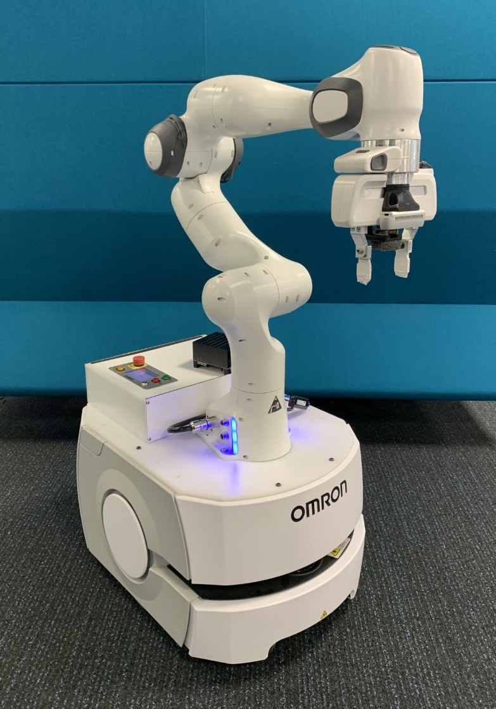

# Frankie Mobile Manipulator

Frankie is a mobile manipulator developed by the [QUT Centre for Robotics](https://research.qut.edu.au/qcr/) consisting of a 7 degree-of-freedom [Franka Emika](https://www.franka.de/) Panda manipulator coupled to an [Omron LD-60](https://industrial.omron.eu/en/products/ld-60-90) mobile base.

## Simulation
Frankie is available in the [Robotics Toolbox for Python](https://github.com/petercorke/robotics-toolbox-python) and the accompanying [Swift](https://github.com/jhavl/swift) simulation environment.

## CAD
_A Fusion 3D model is [available here](https://cloudstor.aarnet.edu.au/plus/s/3Qo87wlyS5JanZ1) (91MB)_

## Publications
Frankie has been used in the following publications:

- J. Haviland, N. Sünderhauf, and P. Corke, ["A holistic approach to reactive mobile manipulation,"](https://jhavl.github.io/holistic/) *IEEE Robotics and Automation Letters,* 2022.

_Would be good to put on https://github.com/qcr/qcr.github.io as well._
